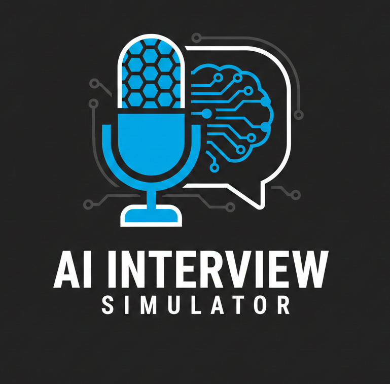

<p align="center">
  
</p>
# 🎙️ AI Interview Simulator – Streamlit Interview Chatbot

This project is a fully interactive **AI-powered interview simulator** built with **Streamlit**, **OpenAI**, and a clean session-state architecture. It mimics a real interview experience, generates dynamic questions based on the user’s profile, tracks the entire conversation, and finishes with an automated performance evaluation.

Whether you’re prepping for your dream job or building an HR screening tool, this app delivers a streamlined, modern interview flow powered by LLMs.

---

## 🚀 Features

- **User Profile Capture**  
  Collects name, experience, skillset, company, role, and job level.

- **Adaptive AI Interview**  
  HR-style AI agent asks up to 5 tailored interview questions using OpenAI GPT.

- **Streaming Responses**  
  Smooth, real-time answer generation using `st.write_stream()`.

- **Deep Session Management**  
  Everything is stored in `st.session_state`: messages, progress, count limits, and more.

- **Automatic Evaluation**  
  After the interview, the model generates:  
  **✓ A score (1–10)**  
  **✓ Structured feedback**  
  **✓ No extra questions, no extra fluff**

- **Restart Flow**  
  A single button reloads the entire interface using `streamlit_js_eval()`.

---

## 🧠 Tech Stack

- **Python 3.10+**
- **Streamlit**
- **OpenAI API (gpt-4o)**
- **streamlit_js_eval**
- **Session State Logic**
- **Streaming Chat Completions**

---

## 📦 Installation

```bash
git clone https://github.com/Sama-ndari/Interview-tool.git
cd Interview-tool
pip install -r requirements.txt
